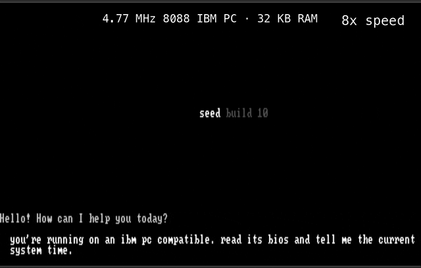

# Seed



**A frontier cloud model writes 8088 machine code, ships it over the network to a
1981 IBM PC, and runs it there — then reads the result back into its own context.**
Seed is the 16 KiB real-mode runtime that makes that loop possible. It boots a
4.77 MHz Intel 8088 from a 5.25-inch floppy, hand-rolls a TLS 1.2 record layer
(ChaCha20-Poly1305, SHA-256, the full handshake state machine) to reach a cloud
model, drops you into a chat loop, and hands that model three tools: read, write,
and *execute* the machine's own memory. The executed programs are tiny so far — the
validated proof is four bytes, `mov ax,0x1234; ret`, written into a RAM arena, run, and
read back — but the loop is real end to end. Small and slow, but it works.

It's a small, trusted control plane — not an OS, not a sandbox — that brings a
memory-constrained machine to a cloud model, publishes a clear hardware and memory
contract, then gets out of the way and leaves the rest open for user- and agent-built
tooling. The boot floppy is the reset boundary, so recovery is always a reboot away.


## Why it's interesting

Three things make Seed unusual:

- **A frontier model runs code on the machine.** Build 10 gives the cloud model
  three tools — read, write, and *execute* memory (`$r`/`$w`/`$x`) — that it calls
  inline in its replies. It pokes 8088 machine code into a free RAM arena, runs
  it, and reads the result; Seed loops each result back into the model's context, so
  the model acts on what it finds. The only safety net is the reboot floppy.
- **A TLS stack in 16 KiB.** The TLS 1.2 record path — handshake state machine,
  SHA-256 transcript, key schedule, ChaCha20-Poly1305 record crypto, HTTP/1.1, and
  SSE (server-sent events) streaming — fits a 16 KiB RAM budget. It works by *not*
  keeping it all resident: a 2 KiB nucleus and a 7 KiB crypto window stay in memory,
  while 19 other **phases** (chunks of code) stream off the floppy on demand and
  time-share one small RAM **window**.
- **…on a 4.77 MHz 8088.** That symmetric crypto — ChaCha20-Poly1305 and SHA-256 —
  runs on a sub-MIPS 16-bit CPU with no crypto acceleration, using hand-tuned field
  arithmetic, prepared HMAC pads, and an add-rotate-xor cipher that suits the part.
  Boot to first token is seconds, not minutes.

**Status — what's real, and what isn't.** The record layer genuinely runs —
ChaCha20-Poly1305, SHA-256, and the full TLS 1.2 handshake, over a live session — but
it is **not a secure channel yet.** The shipped build skips the ECDH key exchange (a
stub takes the server's public value as the premaster, and client randomness is a
placeholder), so a passive observer could derive the keys. The full P-256 is written
and OpenSSL-checked, just compiled out — a real scalar multiply is minutes of work and
several KB the 8088 can't spare — so wiring in a secure exchange (ephemeral scalar plus
real entropy) is the headline open problem. Full story:
[docs/architecture.md](docs/architecture.md).

## Authorship

Every line of seed's code — the 8088 assembly, the hand-rolled TLS stack, the build
tooling — was written by AI coding agents, not by me. The build relayed across four
frontier models as each hit its limits: Codex (GPT-5.4) → Claude Code (Opus 4.7) →
Codex (GPT-5.5) → Claude Code (Opus 4.8); twice, the unlock was a new model landing at
just the right moment. One Codex session logged 28h 25m of work. I worked one level up —
product, architecture, and algorithm decisions, often proposing the approach that got us
unstuck — but never the implementation itself. The agent that runs *on* the machine is a
frontier model too: GPT-5 in the demo.

## How to read these docs

New here? Read **[architecture.md](docs/architecture.md)** (how it works), then
**[memory.md](docs/memory.md)** (the stage-by-stage memory picture), and stop.
Everything else is contributor and runtime-contract reference — including the dated
logs in `notes/`, which record how this was actually built, mistakes and all.

## Minimum Specs

Current IBM PC 5150 target:

```text
CPU       8088-compatible, 4.77 MHz
RAM       16 KiB minimum through ROM BASIC sidecar entry
          32 KiB minimum for direct BIOS floppy boot
media     160 KiB 5.25-inch FAT12 floppy image
video     BIOS text mode, CGA or MDA
network   supported ISA Ethernet adapter
emulator  86Box profiles are provided for development and verification
```

Supported network families on the current target:

```text
3Com 3c501
3Com 3c503
NE1000 / NE2000 compatible
Novell NE1000 compatible
WD8003 compatible
```

No-card machines fail cleanly with a text error and retry/restart choices.

## Current Capability

On the IBM PC 5150 target, Seed can:

- start from the 160 KiB floppy image,
- enter through direct BIOS boot on machines with enough RAM,
- enter through a generated ROM BASIC helper on 16 KiB machines,
- detect supported ISA Ethernet adapters,
- acquire IPv4 configuration with DHCP and resolve hostnames with DNS,
- open a TCP connection to the selected agent provider,
- complete the current minimal TLS 1.2 provider path,
- run the **chat loop** (the "Default Prompt Interface", DPI): an initial model
  greeting, prompt input, and streamed model responses across multiple turns in
  one boot session,
- carry recent conversation across turns — a rolling window of recent turns,
  trimmed to fit the machine's RAM (Build 10; see Known Limitations),
- run model-authored code in the machine's RAM (Build 10): the model issues inline
  `$r`/`$w`/`$x` calls to read, write, and execute segment-0 memory, and Seed feeds
  each result back into its context (the agentic loop, capped at 8 hops per turn),
- detect installed RAM and scale the conversation pool to it (Build 10),
- use shipped `AGENTS.CFG` / `NET.CFG` defaults and optional local `USER.CFG`
  state when present.

## Known Limitations

Seed is a working agent on real 1981 hardware, with the rough edges that implies:

- **Memory is tight on small machines.** The conversation window scales with RAM;
  on a 16 KiB machine it is only ~100 bytes and the sliding-window trim is
  aggressive, so the agent forgets recent turns quickly — it may not recall an
  action (e.g. a tool call) it took a few turns earlier. More RAM means a larger
  window and longer memory. Model-driven summary compaction (more context per
  byte) is planned.
- **Reconnect after a long idle.** The TLS session is held open across a response,
  but a long idle at the prompt lets the server close it. The next message
  reconnects, and if that single attempt loses the ~15 s handshake race it returns
  to the prompt with no answer — re-send and it reconnects. Automatic multi-attempt
  reconnect is planned.
- **Long replies render slowly.** Drawing to the text screen is the bottleneck,
  not the network; a very long reply can take minutes to fully render.
- **The TLS path is not a secure channel.** The hand-rolled handshake does no real
  key agreement — enough to reach the provider, not to protect the traffic. See
  [docs/networking.md](docs/networking.md).

## Build

Prerequisites: `nasm`, `make`, and `86Box` for emulator testing.

```sh
make                 # build the FAT12 floppy image
make inspect         # inspect the image and memory layout
make basic-bootstrap # generate the ROM BASIC sidecar helpers (sub-32 KiB entry)
```

Run it under 86Box:

```sh
tools/run-86box.sh                                          # default no-card profile
tools/run-86box.sh vm-net-ne2k8                             # a NIC-present profile
tools/run-basic-bootstrap-86box.py --profile vm-net-ne2k8  # automated sidecar harness
```

The generated boot image is `build/ibm_pc_5150/floppy-160k.img`. See
[docs/testing.md](docs/testing.md) for boot modes, validation recipes, and the
emulator gotchas.

## Repository Map

```text
Makefile                       build the FAT12 160 KiB floppy image
config/                        shipped AGENTS.CFG / NET.CFG defaults
docs/architecture.md           how Seed works + the hardware/memory contract
docs/memory.md                 stage-by-stage byte-level memory maps
docs/builds.md                 milestone and scope history (the roadmap)
docs/{config,networking,ui,testing}.md   config, transport, UI, and test reference
notes/                         design notes and the dated implementation logs
targets/ibm_pc_5150/           8088 boot sector, loader, and CORE.SYS core source
targets/ibm_pc_5150/86box/     86Box profiles and NIC inventory
tools/run-86box.sh             build and launch an 86Box profile
tools/run-basic-bootstrap-86box.py   launch 86Box and inject the BASIC sidecar
```

Other `tools/*.py` are the image builder, the BASIC-sidecar builder, the
`CORE.SYS` inspector, and dependency-free crypto checkers — see `AGENTS.md`.

## Runtime Contract

Seed stays text-mode first: it reads the active BIOS text column count and adapts
to it rather than switching video modes.

Seed-owned memory ranges are **cooperation boundaries, not hardware-enforced
protection**. Agent-built tools may use the machine directly outside Seed-owned
ranges; if they violate the published contract, that tool owns the crash and the
boot floppy remains the recovery path.

Stored user config is optional. Missing, unreadable, or invalid config means Seed
asks the user; failed writes are ignored so read-only boot media stay usable.

Future host loaders may enter `CORE.SYS` from an already-running system instead of
booting the floppy. Those loaders should behave as one-way chainloaders that
abandon the host runtime, not as normal host applications.
