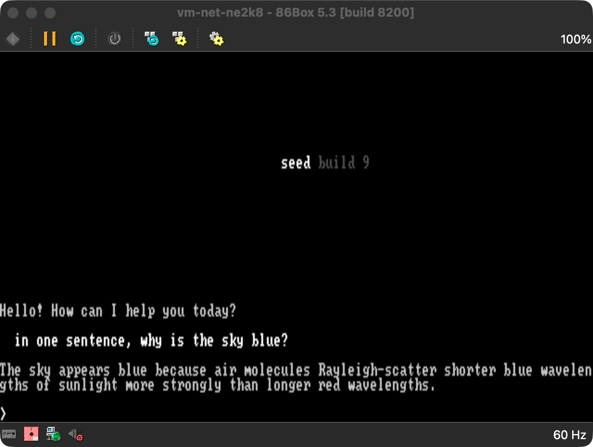

# Seed

**Seed runs a full modern AI-agent stack — real TLS 1.2 (P-256 ECDHE,
ChaCha20-Poly1305, SHA-256), HTTP, and streamed responses — in 16 KiB of RAM on
a 4.77 MHz Intel 8088.** It boots from a 5.25-inch floppy on a 1981-class IBM PC,
dials a cloud model directly over the network, and drops you into a chat loop.
Small and slow, but it works.

Seed is a boot-first *agent runtime*: a small, trusted control plane — not an
operating system and not a sandbox. Its job is to bring a memory-constrained
machine far enough to reach a cloud model, publish a clear hardware and memory
contract, then get out of the way and leave the rest of the machine open for
user- and agent-built local tooling. The boot floppy stays the reset boundary,
so recovery is always a reboot away.



## Why it's interesting

Two things make Seed unusual:

- **A full agent stack in 16 KiB.** The entire TLS 1.2 path — handshake, key
  schedule, ChaCha20-Poly1305 record crypto, HTTP, and streamed responses — fits
  a 16 KiB RAM budget. It works by *not* keeping it all resident: a 2 KiB nucleus
  and a 7 KiB crypto window stay in memory, while 18 other **phases** (chunks of
  code) stream off the floppy on demand and time-share one small RAM **window**.
- **…on a 4.77 MHz 8088.** That same modern crypto — P-256 ECDHE,
  ChaCha20-Poly1305, SHA-256 — runs on a sub-MIPS 16-bit CPU with no crypto
  acceleration, using hand-tuned field arithmetic, a reused TLS session, and an
  add-rotate-xor cipher that suits the part. Boot to first response is seconds,
  not minutes.

One honest caveat up front: the current build uses a **fixed development scalar**
for the ECDHE step (a real constant-time full scalar runs into minutes on this
CPU), so **this is not yet secure TLS** — a real entropy source and a faster
scalar path are required first. The full CPU/crypto story, with a boot timing
diagram, is in [docs/architecture.md](docs/architecture.md).

## How to read these docs

New here? **[README](README.md) → [architecture.md](docs/architecture.md)** (how
it works) **→ [memory.md](docs/memory.md)** (the stage-by-stage picture), then
stop. Everything else — `docs/{builds,config,networking,testing,ui}.md`,
`AGENTS.md`, and the files under `targets/` — is contributor and
runtime-contract reference. That includes the dated test logs in `notes/` and the
target docs, which record how this was actually built, mistakes and all.

## Minimum Specs

Current IBM PC 5150 target:

```text
CPU       8088-compatible, 4.77 MHz
RAM       16 KiB minimum through ROM BASIC sidecar entry
          32 KiB minimum for direct BIOS floppy boot
media     160 KiB 5.25-inch FAT12 floppy image
video     BIOS text mode, CGA or MDA
network   supported ISA Ethernet adapter
emulator  86Box profiles are provided for development and verification
```

Supported network families on the current target:

```text
3Com 3c501
3Com 3c503
NE1000 / NE2000 compatible
Novell NE1000 compatible
WD8003 compatible
```

No-card machines fail cleanly with a text error and retry/restart choices.

## Current Capability

On the IBM PC 5150 target, Seed can:

- start from the 160 KiB floppy image,
- enter through direct BIOS boot on machines with enough RAM,
- enter through a generated ROM BASIC helper on 16 KiB machines,
- detect supported ISA Ethernet adapters,
- acquire IPv4 configuration with DHCP and resolve hostnames with DNS,
- open a TCP connection to the selected agent provider,
- complete the current minimal TLS 1.2 provider path,
- run the **chat loop** (the "Default Prompt Interface", DPI): an initial model
  greeting, prompt input, and streamed model responses across multiple turns in
  one boot session,
- carry recent conversation across turns — a model-compacted rolling summary that
  keeps prompts from being semantically fresh (Build 9),
- use shipped `AGENTS.CFG` / `NET.CFG` defaults and optional local `USER.CFG`
  state when present.

## Build

Prerequisites: `nasm`, `make`, and `86Box` for emulator testing.

```sh
make                 # build the FAT12 floppy image
make inspect         # inspect the image and memory layout
make basic-bootstrap # generate the ROM BASIC sidecar helpers (sub-32 KiB entry)
```

Run it under 86Box:

```sh
tools/run-86box.sh                                          # default no-card profile
tools/run-86box.sh vm-net-ne2k8                             # a NIC-present profile
tools/run-basic-bootstrap-86box.py --profile vm-net-ne2k8  # automated sidecar harness
```

The generated boot image is `build/ibm_pc_5150/floppy-160k.img`. See
[docs/testing.md](docs/testing.md) for boot modes, validation recipes, and the
emulator gotchas.

## Repository Map

```text
Makefile                       build the FAT12 160 KiB floppy image
config/                        shipped AGENTS.CFG / NET.CFG defaults
docs/architecture.md           how Seed works + the hardware/memory contract
docs/memory.md                 stage-by-stage byte-level memory maps
docs/builds.md                 milestone and scope history (the roadmap)
docs/{config,networking,ui,testing}.md   config, transport, UI, and test reference
notes/                         design notes and the dated implementation logs
targets/ibm_pc_5150/           8088 boot sector, loader, and CORE.SYS core source
targets/ibm_pc_5150/86box/     86Box profiles and NIC inventory
tools/run-86box.sh             build and launch an 86Box profile
tools/run-basic-bootstrap-86box.py   launch 86Box and inject the BASIC sidecar
```

Other `tools/*.py` are the image builder, the BASIC-sidecar builder, the
`CORE.SYS` inspector, and dependency-free crypto checkers — see `AGENTS.md`.

## Runtime Contract

Seed stays text-mode first: it reads the active BIOS text column count and adapts
to it rather than switching video modes.

Seed-owned memory ranges are **cooperation boundaries, not hardware-enforced
protection**. Agent-built tools may use the machine directly outside Seed-owned
ranges; if they violate the published contract, that tool owns the crash and the
boot floppy remains the recovery path.

Stored user config is optional. Missing, unreadable, or invalid config means Seed
asks the user; failed writes are ignored so read-only boot media stay usable.

Future host loaders may enter `CORE.SYS` from an already-running system instead of
booting the floppy. Those loaders should behave as one-way chainloaders that
abandon the host runtime, not as normal host applications.
