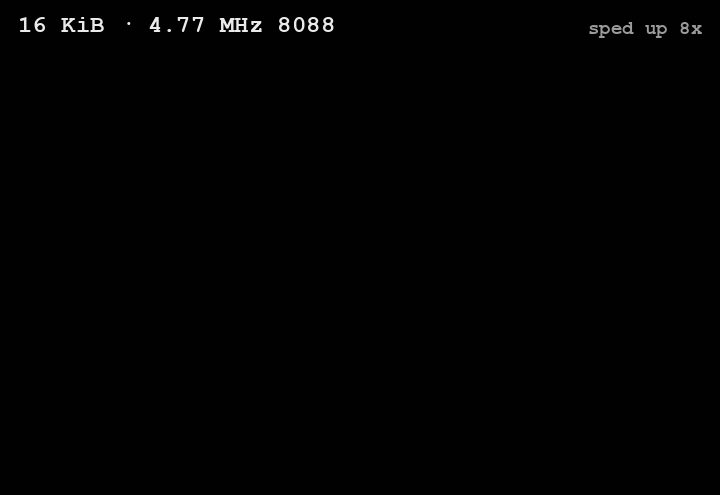
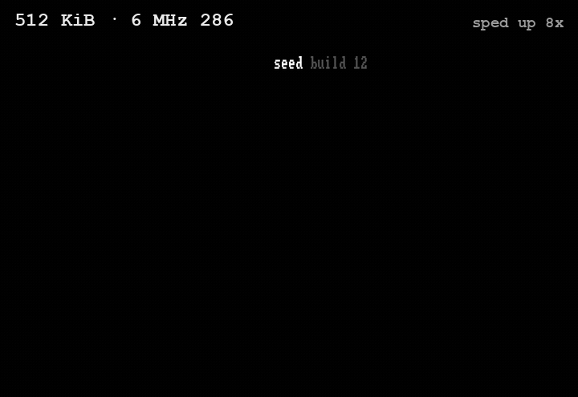
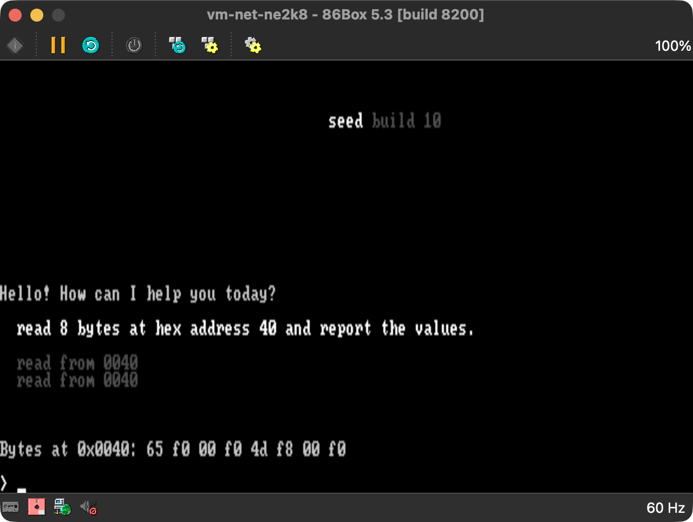

# Seed

<p align="center">
  
  
</p>

<p align="center"><sub><b>Same prompt, typed at the same moment, on two machines from the <code>seed build 12</code> splash.</b> &nbsp; Left: 16 KiB · 4.77 MHz 8088 — <i>encrypted, not secure</i>. &nbsp; Right: 6 MHz 286 — <i>secure, and it finishes first</i>. &nbsp; 86Box, sped up 8×.</sub></p>

**A frontier cloud model writes 8088 machine code, ships it over the network to a
1981 IBM PC, and runs it there — then reads the result back into its own context.**
Seed is the 16 KiB real-mode runtime that makes that loop possible. It boots a
4.77 MHz Intel 8088 from a 5.25-inch floppy, hand-rolls a TLS 1.2 record layer
(ChaCha20-Poly1305, SHA-256, the full handshake state machine) to reach a cloud
model, drops you into a chat loop, and hands that model three tools: read, write,
and *execute* the machine's own memory. The executed programs are tiny so far — the
validated proof is four bytes, `mov ax,0x1234; ret`, written into a RAM arena, run, and
read back — but the loop is real end to end. Small and slow, but it works.

It's a small, trusted control plane — not an OS, not a sandbox — that brings a
memory-constrained machine to a cloud model, publishes a clear hardware and memory
contract, then gets out of the way and leaves the rest open for user- and agent-built
tooling. The boot floppy is the reset boundary, so recovery is always a reboot away.



## Why it's interesting

Four things make Seed unusual:

- **A frontier model runs code on the machine.** Seed exposes native function tools
  to read, write, and *execute* memory (`read_mem`, `write_mem`, `exec`). The model
  can poke 8088 machine code into a free RAM arena, run it, and read the result; Seed
  loops each result back into the model's locally-owned context with `store:false`.
  Memory read/write calls are currently capped at 4 bytes while the native tool loop
  is hardened. The only safety net is the reboot floppy.
- **A TLS stack in 16 KiB.** The TLS 1.2 record path — handshake state machine,
  SHA-256 transcript, key schedule, ChaCha20-Poly1305 record crypto, HTTP/1.1, and
  SSE (server-sent events) streaming — fits a 16 KiB RAM budget. It works by *not*
  keeping it all resident: a 2 KiB nucleus and a 7 KiB crypto window stay in memory,
  while 27 other **phases** (chunks of code) stream off the floppy on demand and
  time-share one small RAM **window**.
- **One floppy scales past segment 0.** The same `CORE.SYS` starts at the 16 KiB
  floor, uses a cached loop at 32 KiB, grows context and arena through far
  conventional memory, drives EMS boards on 8088/V30-class machines, reaches 286
  HMA/native extended memory, and uses 386 unreal mode for BIOS-compatible flat
  high-memory access.
- **…on a 4.77 MHz 8088.** That symmetric crypto — ChaCha20-Poly1305 and SHA-256 —
  runs on a sub-MIPS 16-bit CPU with no crypto acceleration, using hand-tuned field
  arithmetic, prepared HMAC pads, and an add-rotate-xor cipher that suits the part.
  Boot to first token is seconds, not minutes.

**Status — what's real, and what isn't.** The record layer genuinely runs —
ChaCha20-Poly1305, SHA-256, and the full TLS 1.2 handshake, over a live session. Whether
that channel is *secure* is CPU-tiered, and the product says so honestly:

- **On a stock 8088 (4.77 MHz) it is encrypted, not secure.** A real ECDH scalar
  multiply is ~110 s here — minutes past the server's handshake window — so the boot
  path substitutes a stub (the server's public value becomes the premaster) and a passive
  observer could derive the keys. The full P-256 is written and OpenSSL-checked, just
  compiled out; it *fits* the RAM (~3.4 KB), so the wall is CPU time, not space. A pre-286
  machine shows a dim **"insecure"** on the splash to say so.
- **On a 286 it is a real secure channel (shipped, Build 12).** The optimised
  constant-time P-256 does a genuine ephemeral ECDHE key agreement, and the server is
  authenticated by verifying its RSA-2048 signature against a **pinned `api.openai.com`
  key** — one in-race RSA verify, which is what makes a secure handshake fit the window
  (8 MHz is the comfortable floor; 6 MHz is a knife-edge). When the pinned leaf rotates
  (~90 days), the device silently re-pins — it checks the freshly-presented leaf is signed
  by the pinned Google Trust Services CA that issued it, off the handshake race, and adopts
  it. No rebuild, fail-closed.

Full story: [docs/architecture.md](docs/architecture.md).

## Try it

A prebuilt floppy image is on the [Releases](https://github.com/tonism/seed/releases)
page — `seed-160k.img` (160 KB, **no API key included**).

1. **Boot it in [86Box](https://86box.net/).** Configure an IBM PC/XT-class machine
   with **≥ 32 KB RAM** (16 KB boots, but the agent can barely remember a turn) and a
   supported NIC (NE1000/NE2000, 3c501/3c503, or WD8003). Mount `seed-160k.img` as
   floppy A: and boot. The repo ships 86Box profiles — see `tools/run-86box.sh`.
2. **Bring your own key.** On first boot Seed asks for a provider and key — pick
   OpenAI and paste yours. If the floppy is writable, Seed saves it for next time.

To **skip typing the key**, put a `USER.CFG` on the image before booting:

```text
agent openai
model gpt-5.5
key sk-your-openai-key
```

(`model` is whatever id your account can use.) Inject it with
[mtools](https://www.gnu.org/software/mtools/):
`mcopy -i seed-160k.img USER.CFG ::USER.CFG` — or rebuild from source with
`config/USER.CFG` in place.

> ⚠️ **Use a throwaway, rate-limited key.** On a pre-286 machine seed's channel is
> **not secure** (the key exchange is stubbed — see Status above), so the `Authorization`
> header is exposed to anyone on the network path — and the "Try it" steps above boot
> exactly such a machine. Even on a secure 286, `USER.CFG` stores the key in plaintext on
> the image. Use a disposable key with strict limits, revoke it afterward, and don't share
> an image that has your key in it. For a genuinely secure channel, run Seed on a 286 or
> faster — see [System Requirements](#system-requirements).

## Authorship

Every line of seed's code — the 8088 assembly, the hand-rolled TLS stack, the build
tooling — was written by AI coding agents. The build was a deliberate relay across four
frontier models — not one-shot prompting — steered and coordinated as each hit its limits
(Codex GPT-5.4 → Claude Code Opus 4.7 → Codex GPT-5.5 → Claude Code Opus 4.8); twice, the
unlock was a new model landing at just the right moment. One Codex session logged 28h 25m
of work. I worked a level up — product, architecture, and the algorithm calls, often
proposing the approach that got us unstuck — and left the implementation to the agents.
The model that runs *on* the machine is a frontier model too: GPT-5.5 in the demo.

## How to read these docs

New here? Read **[architecture.md](docs/architecture.md)** (how it works), then
**[memory.md](docs/memory.md)** (the 16 KiB stage maps plus larger memory-profile
examples), and stop.
Everything else is contributor and runtime-contract reference — including the dated
logs in `notes/`, which record how this was actually built, mistakes and all.

## System Requirements

**Minimum — any PC.** Seed runs on a bone-stock 1981 IBM PC: a 4.77 MHz 8088 with
16 KiB of RAM. The whole agent loop is functional at this floor — chat, the native
read/write/execute tools, and the full TLS 1.2 record layer — though on a pre-286 CPU
the channel is encrypted, *not* secure (see the recommendation below).

```text
CPU       8088-compatible, 4.77 MHz  (any PC)
RAM       16 KiB minimum through ROM BASIC sidecar entry
          32 KiB minimum for direct BIOS floppy boot
media     160 KiB 5.25-inch FAT12 floppy image
video     BIOS text mode, CGA or MDA
network   supported ISA Ethernet adapter
emulator  86Box profiles are provided for development and verification
```

**Recommended — a 286, for a secure channel.** Confidentiality is CPU-tiered, and this
is the one thing the 8088 floor cannot do. Below the 286 the key exchange is stubbed, so
the connection is *encrypted but not secure* — anyone on the network path can recover the
session keys, and a pre-286 machine says so with a dim **"insecure"** splash. A **286 or
faster** runs a real authenticated handshake — ephemeral ECDHE key agreement plus a
pinned-key RSA-2048 certificate verify — inside the provider's handshake window: **8 MHz
is comfortable, 6 MHz works on a knife-edge.**

> **If the channel needs to be secure, use a 286 or faster.** On anything slower, treat
> the connection as public and use only a throwaway, rate-limited key. Details in
> **Status** above and [docs/architecture.md](docs/architecture.md).

Supported network families on the current target:

```text
3Com 3c501
3Com 3c503
NE1000 / NE2000 compatible
Novell NE1000 compatible
WD8003 compatible
```

No-card machines fail cleanly with a text error and retry/restart choices.

## Current Capability

On the IBM PC 5150 target, Seed can:

- start from the 160 KiB floppy image,
- enter through direct BIOS boot on machines with enough RAM,
- enter through a generated ROM BASIC helper on 16 KiB machines,
- detect supported ISA Ethernet adapters,
- acquire IPv4 configuration with DHCP and resolve hostnames with DNS,
- open a TCP connection to the selected agent provider,
- complete the current minimal TLS 1.2 provider path,
- run the **chat loop** (the "Default Prompt Interface", DPI): an initial model
  greeting, prompt input, and streamed model responses across multiple turns in
  one boot session,
- carry recent conversation across turns through local model-written compaction and
  a RAM-scaled rolling window, with API requests sent as `store:false`,
- run model-authored code in the machine's RAM: native tool calls read, write, and
  execute flat memory addresses, and Seed feeds each result back through structured
  `function_call_output` items; memory read/write calls are currently capped at
  4 bytes per call,
- save and load the local environment on writable media with native `save_env` and
  `load_env` tools,
- detect installed RAM and scale the conversation/context arena through far
  conventional memory, EMS, 286 HMA/native extended memory, and 386 unreal mode,
- use shipped `AGENTS.CFG` / `NET.CFG` defaults and optional local `USER.CFG`
  state when present.

## Known Limitations

Seed is a working agent on real 1981 hardware, with the rough edges that implies:

- **Memory is tight on small machines.** The 16 KiB floor is deliberately tiny:
  the current native-tool layout has a 96 B context window and a 96 B arena. More
  RAM quickly changes the shape — 32 KiB gets a cached loop, conventional RAM adds
  far arena/context, EMS adds megabytes on an 8088, and 286/386 machines move the
  context to high memory. The smallest machines still forget oldest turns first.
- **Reconnect after a long idle.** The TLS session is held open across a response,
  but a long idle at the prompt lets the server close it. The next message reconnects
  automatically — a dim `> reconnect` line, then up to three silent retries; if all
  three lose the ~15 s handshake race it shows `> reconnect failed` and returns to the
  prompt, where re-sending runs the reconnect loop again. Never a blank turn.
- **Long replies render slowly.** Drawing to the text screen is the bottleneck,
  not the network; a very long reply can take minutes to fully render.
- **Security is CPU-tiered.** On a stock 8088 the hand-rolled handshake does no real
  key agreement — encrypted, but not a secure channel. Security begins at the 286: real
  ECDHE plus a pinned-key RSA certificate verify, with silent re-pinning when the leaf
  rotates (shipped, Build 12). See [docs/architecture.md](docs/architecture.md).

## Build

Prerequisites: `nasm`, `make`, and `86Box` for emulator testing.

```sh
make                 # build the FAT12 floppy image
make inspect         # inspect the image and memory layout
make basic-bootstrap # generate the ROM BASIC sidecar helpers (sub-32 KiB entry)
```

Run it under 86Box:

```sh
tools/run-86box.sh                                          # default no-card profile
tools/run-86box.sh vm-net-ne2k8                             # a NIC-present profile
tools/run-basic-bootstrap-86box.py --profile vm-net-ne2k8  # automated sidecar harness
```

The generated boot image is `build/ibm_pc_5150/floppy-160k.img`. See
[docs/testing.md](docs/testing.md) for boot modes, validation recipes, and the
emulator gotchas.

## Repository Map

```text
Makefile                       build the FAT12 160 KiB floppy image
config/                        shipped AGENTS.CFG / NET.CFG defaults
docs/architecture.md           how Seed works + the hardware/memory contract
docs/memory.md                 16 KiB byte-level maps + larger memory-profile examples
docs/builds.md                 milestone and scope history (the roadmap)
docs/crypto-feasibility.md     why a secure handshake needs a 286 (the crypto research)
docs/{config,networking,ui,testing}.md   config, transport, UI, and test reference
notes/                         design notes and the dated implementation logs
targets/ibm_pc_5150/           8088 boot sector, loader, and CORE.SYS core source
targets/ibm_pc_5150/86box/     86Box profiles and NIC inventory
tools/run-86box.sh             build and launch an 86Box profile
tools/run-basic-bootstrap-86box.py   launch 86Box and inject the BASIC sidecar
```

Other `tools/*.py` are the image builder, the BASIC-sidecar builder, the
`CORE.SYS` inspector, and dependency-free crypto checkers — see `AGENTS.md`.

## Runtime Contract

Seed stays text-mode first: it reads the active BIOS text column count and adapts
to it rather than switching video modes.

Seed-owned memory ranges are **cooperation boundaries, not hardware-enforced
protection**. Agent-built tools may use the machine directly outside Seed-owned
ranges; if they violate the published contract, that tool owns the crash and the
boot floppy remains the recovery path.

Stored user config is optional. Missing, unreadable, or invalid config means Seed
asks the user; failed writes are ignored so read-only boot media stay usable.

Future host loaders may enter `CORE.SYS` from an already-running system instead of
booting the floppy. Those loaders should behave as one-way chainloaders that
abandon the host runtime, not as normal host applications.
